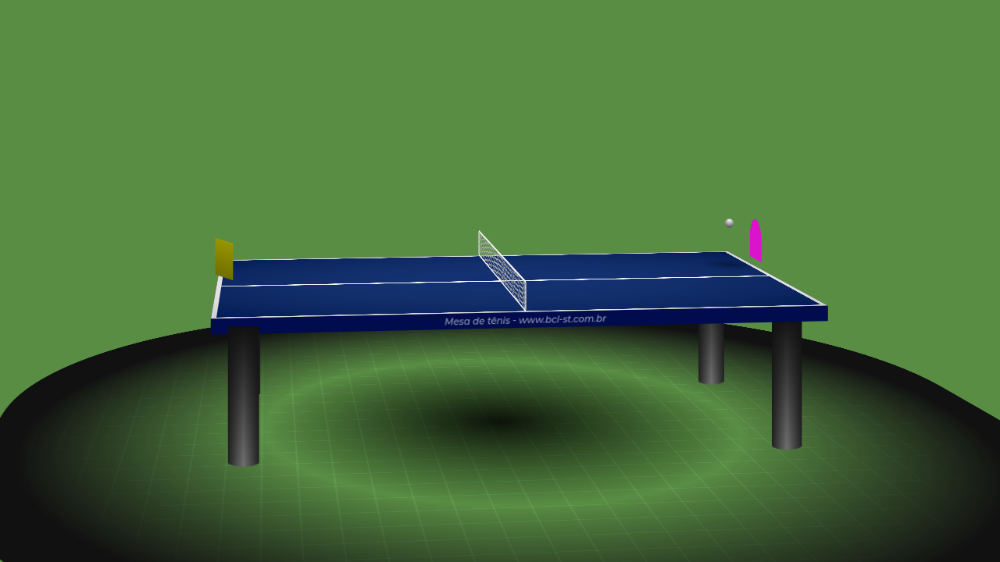

# Mesa de Tênis por Brenno BCL-ST

Uma mesa de tennis criada com HTML5 e CSS puro

Author: `Brenno C. lins - BCL-ST`

 


# Table Tennis by Brenno BCL-ST

Tennis table created with HTML5 and pure CSS 

Created by `Brenno - BCL-ST`


### Links

- [BCL-ST](https://www.bcl-st.com.br)
- [DevMeditation](https://www.instagram.com/devmeditation/)
- [Twitter](https://twitter.com/BrennoCLins)

### Projeto baseado / Project Based on: 

- [Projeto inspirado no original](https://dev.to/ben/table-tennis-in-pure-html-css-4ic9)

---

## Instalação / Install

```js
git clone https://github.com/brennoclins/BCL-ST_table_tenny.git

cd BCL-ST_table_tenny
```

### OBS.: Abra em seu navegador favorito o arquivo `index.html`


### Informações sobre o projeto / Project information: 

- Created: `04-03-2021`;
- Updated: `29-04-2021`;